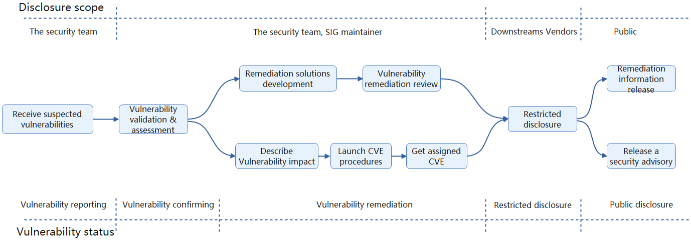

# Security Policy

## Report a Vulnerability

We sincerely request you to keep the vulnerability information confidential and responsibly disclose the vulnerabilities.

To report a vulnerability, please contact the Security Team by sending an email to [volcano-security@googlegroups.com](mailto:volcano-security@googlegroups.com).

For full details on the reporting process, including what to include in your report, our response timeline, and specific reporting scenarios, please refer to the complete procedure:
- **[Procedure: Report a Vulnerability](./report-a-vulnerability.md)**

## Security Release Process

The Volcano community will strictly handle the reporting vulnerability according to this [procedure](security-release-process.md). The following flowchart shows the vulnerability handling process.

## Security Communications and Lists

The Volcano Security Team manages several communication channels for security-related matters.

- **Security Team Membership:** A list of current security team members and their responsibilities is managed in [security-groups.md](./security-groups.md).
- **Private Distributors List:** For information on how Volcano distributors or vendors can apply to join our private disclosure list, including the embargo policy and membership criteria, please see the [private-distributors-list.md](./private-distributors-list.md).

## Supported Versions

Volcano versions are expressed as x.y.z, where x is the major version, y is the minor version, and z is the patch version, following [Semantic Versioning](https://semver.org/) terminology.

The Volcano project maintains release branches for the most recent three minor releases. Applicable fixes, including security fixes, may be backported to those three release branches, depending on severity and feasibility.

Our typical release cadence for minor versions is every 4 months, while patch releases are issued every 1-2 months. Critical bug fixes may cause a more immediate patch release outside of the normal cadence. We also aim to not make releases during major holiday periods.

See the [Volcano releases page](https://github.com/volcano-sh/volcano/releases) for information on supported versions of Volcano.

## Dependencies Policy

Dependencies are evaluated before being introduced to ensure they:

1) are actively maintained
2) are maintained by trustworthy maintainers
3) are licensed in a way not to impact the Volcano license based on [the CNCF license allowlist](https://github.com/cncf/foundation/blob/main/allowed-third-party-license-policy.md).

These evaluations vary from dependency to dependencies.

Dependencies are also scheduled for removal if the project has been deprecated or if the project is no longer maintained. Additionally based on license changes we replace dependencies as necessary.