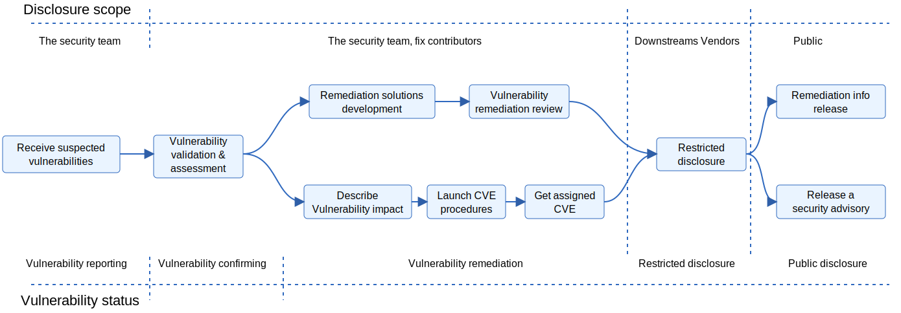

# Security Policy

## Report a Vulnerability

Please keep suspected vulnerability information confidential until the Volcano Security Team completes triage and coordinates disclosure.

To report a vulnerability, please contact the Security Team by sending an email to [volcano-security@googlegroups.com](mailto:volcano-security@googlegroups.com).

Please include enough information for the Security Team to understand and reproduce the issue. Useful reports include:

- A description of the vulnerability and the affected Volcano component.
- The affected Volcano version, Kubernetes version, and deployment configuration.
- Steps to reproduce the issue, including proof-of-concept code, logs, screenshots, or packet captures when available.
- The expected impact, including whether the issue affects confidentiality, integrity, availability, privilege boundaries, or multi-tenant isolation.
- Any known mitigations or workarounds.

The Security Team will review incoming reports and respond as soon as practical. If you do not receive a response in a reasonable time, please contact a Security Team member listed in [security-groups.md](security-groups.md#the-security-team) to confirm receipt.

### When to Report a Vulnerability

- You believe you have discovered a potential security vulnerability in Volcano.
- You are unsure whether an issue has security impact on Volcano.

### When Not to Report a Vulnerability

- You need help tuning Volcano components for security.
- You need help applying security-related updates.
- The issue is not security related.

If you discover a vulnerability in another project that Volcano depends on, and that project has its own vulnerability reporting and disclosure process, please report it directly to that project.

## Security Release Process

The Volcano community handles reported vulnerabilities according to this [procedure](security-release-process.md). The following flowchart shows the vulnerability handling process.

## Security Communications and Lists

Security Team membership and security mailing lists are maintained in [security-groups.md](./security-groups.md). Information about private distributor notifications, including the embargo policy and membership criteria, is documented in [private-distributors-list.md](./private-distributors-list.md).

## Access Control and Assessments

The Volcano project documents repository and security response access controls in [access-control.md](./access-control.md).

The Security Team maintains security assessment material in [assessments](./assessments), including the [security self-assessment](./assessments/self-assessment.md).

Volcano completed a third-party security audit with Ada Logics and OSTIF in collaboration with the CNCF in 2025. The published report is linked from the [security assessments](./assessments/README.md#third-party-security-review).

## Supported Versions

Volcano versions are expressed as x.y.z, where x is the major version, y is the minor version, and z is the patch version, following [Semantic Versioning](https://semver.org/) terminology.

The Volcano project maintains release branches for the most recent three minor releases. Applicable fixes, including security fixes, may be backported to those three release branches, depending on severity and feasibility.

Our typical release cadence for minor versions is every 4 months, while patch releases are issued every 1-2 months. Critical bug fixes may cause a more immediate patch release outside of the normal cadence. We also aim to not make releases during major holiday periods.

See the [Volcano releases page](https://github.com/volcano-sh/volcano/releases) for information on supported versions of Volcano.

## Dependencies Policy

Dependencies are evaluated before being introduced. The project considers whether a dependency is actively maintained, maintained by trustworthy maintainers, and licensed in a way that does not affect the Volcano license based on [the CNCF license allowlist](https://github.com/cncf/foundation/blob/main/allowed-third-party-license-policy.md).

These evaluations vary from dependency to dependency.

Dependencies are also scheduled for removal if the project has been deprecated or if the project is no longer maintained. Additionally based on license changes we replace dependencies as necessary.
