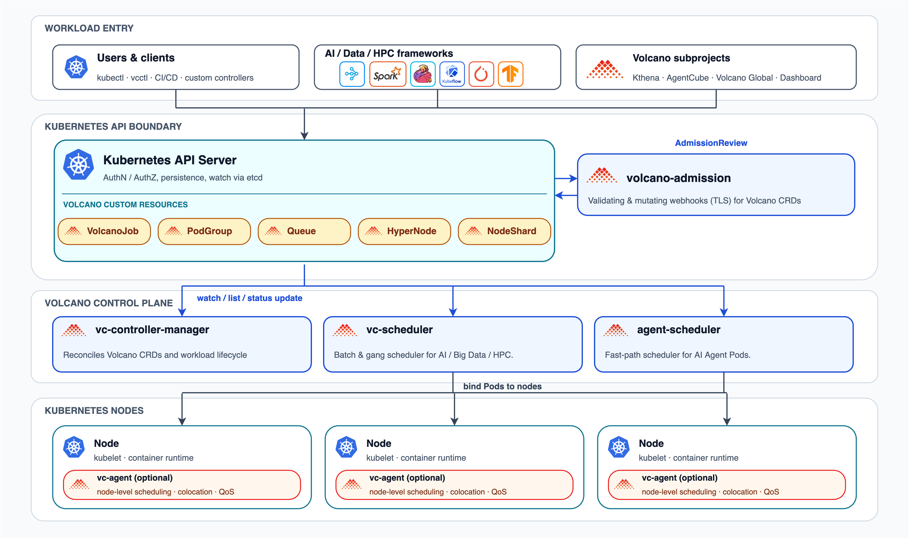

# Volcano Self-Assessment

This self-assessment builds on the Volcano security assessment prepared during the CNCF TAG Security Pals process and updates it for the current Volcano community security process.

The self-assessment is the initial document for Volcano to describe the security of the project, identify gaps in security documentation or practice, and prepare security documentation for users and reviewers.

## Table of Contents

- [Metadata](#metadata)
  - [Security Links](#security-links)
- [Overview](#overview)
  - [Background](#background)
  - [Actors](#actors)
  - [Actions](#actions)
  - [Goals](#goals)
  - [Non-Goals](#non-goals)
- [Self-Assessment Use](#self-assessment-use)
- [Security Functions and Features](#security-functions-and-features)
- [Project Compliance](#project-compliance)
- [Secure Development Practices](#secure-development-practices)
- [Security Issue Resolution](#security-issue-resolution)
- [Appendix](#appendix)
  - [Third-Party Security Audit](#third-party-security-audit)
  - [Known Issues Over Time](#known-issues-over-time)
  - [Badges](#badges)
  - [Follow-Up Items](#follow-up-items)

## Metadata

|                   |                                                                 |
| ----------------- | --------------------------------------------------------------- |
| Assessment Stage  | Complete                                                        |
| Software          | https://github.com/volcano-sh/volcano                           |
| Security Provider | No                                                              |
| Languages         | Go, Shell, Makefile, Dockerfile, Python, Go Template            |
| SBOM              | Volcano does not currently document SBOM publication on release |

### Security Links

| Document | URL |
| -------- | --- |
| Security Policy | https://github.com/volcano-sh/community/blob/master/security-team/SECURITY.md |
| Security Release Process | https://github.com/volcano-sh/community/blob/master/security-team/security-release-process.md |
| Security Team | https://github.com/volcano-sh/community/blob/master/security-team/security-groups.md#the-security-team |
| Access Control | https://github.com/volcano-sh/community/blob/master/security-team/access-control.md |
| Private Distributor Notifications | https://github.com/volcano-sh/community/blob/master/security-team/private-distributors-list.md |
| Third-Party Security Audit | https://github.com/volcano-sh/community/blob/master/security-team/assessments/ada-logics-volcano-security-audit-2025.pdf |

## Overview

[Volcano](https://volcano.sh/) is a cloud native unified scheduling platform for Kubernetes. It originated as a batch scheduling system and now supports converged scheduling for general-purpose workloads and AI computing at scale.

Volcano supports workloads such as batch training, inference, AI Agent, HPC, big data, and heterogeneous accelerator workloads. It integrates with common computing frameworks and platforms such as Ray, Spark, TensorFlow, PyTorch, Flink, Argo, MindSpore, Kubeflow, and PaddlePaddle.

### Background

Volcano provides workload-aware scheduling and resource management for converged computing environments. It supports workloads that require gang scheduling, queueing, fair sharing, preemption, resource reservation, topology awareness, heterogeneous accelerator scheduling, and lifecycle management across multiple pods.

Volcano addresses this by adding workload-aware APIs and scheduling capabilities on top of Kubernetes. The core project includes custom resources such as Jobs, PodGroups, Queues, NodeShards, and HyperNodes. It also includes controllers that reconcile those resources, admission webhooks that validate and mutate related objects, and schedulers that make workload placement decisions.

The Volcano architecture includes native Ray framework support, agent scheduling for latency-sensitive AI Agent workloads, dynamic node scheduling shards across multiple scheduling paths, Volcano Global for multi-cluster scheduling, and node-side resource management through `vc-agent`.

The following diagram shows the main components and interactions in a Volcano deployment. It is an assessment diagram and not a complete deployment reference.

### Actors

The main actors in the Volcano project are:

- **Users:** Individuals or systems that submit and manage workloads through Kubernetes APIs.
- **Kubernetes API Server:** The API server stores Kubernetes and Volcano resources and enforces Kubernetes authentication and authorization.
- **Kubernetes Nodes:** Nodes run the pods scheduled by Volcano and may run node-side Volcano components.
- **Volcano Scheduler:** The scheduler makes batch and gang scheduling decisions for AI, big data, and HPC workloads.
- **Agent Scheduler:** The agent scheduler handles latency-sensitive AI Agent workloads when enabled.
- **Volcano Controller Manager:** The controller manager reconciles Volcano resources and manages workload lifecycle.
- **Volcano Admission:** The admission component validates and mutates Volcano-related resources before they are persisted.
- **Volcano Agent:** `vc-agent` is an optional node-side component that provides node-level scheduling, colocation, and QoS management.
- **Integrated Systems:** Batch frameworks and platform tools that submit workloads to Volcano, such as Ray, Spark, TensorFlow, PyTorch, Flink, Argo, Kubeflow, and related AI or data processing systems.

These actors are separated primarily by Kubernetes API boundaries, Kubernetes RBAC, service accounts, namespaces, admission webhook configuration, and node boundaries. Volcano does not provide a separate project API server. Volcano components communicate through the Kubernetes API server and run as separate Kubernetes workloads or node-side agents depending on the component.

### Actions

#### Workload Submission

Users and integrated systems submit workloads to Volcano through Kubernetes APIs. This includes creating Volcano Jobs, PodGroups, Queues, and related Kubernetes resources. Framework integrations such as Ray, Spark, Flink, Kubeflow, and other platform systems use the same Kubernetes API path when they submit or manage Volcano workloads.

Involved Actors:

- Users
- Integrated Systems
- Kubernetes API Server
- Volcano Admission

Security Checks and System Actions:

- Kubernetes authenticates and authorizes the request according to cluster configuration.
- Kubernetes and Volcano resource schemas validate the submitted objects.
- Volcano admission validates or mutates Volcano-related resources before they are persisted.
- Volcano handles workload specifications and scheduling metadata in this path. Application payload data remains in the workload or external systems.
- Security issues in integrations are triaged with the relevant maintainers when they affect Volcano behavior or Volcano-managed resources.

#### Resource Reconciliation

The Volcano controller manager watches Volcano resources and reconciles their desired and observed state. It updates status, manages workload lifecycle, and coordinates related Kubernetes resources.

Involved Actors:

- Kubernetes API Server
- Volcano Controller Manager
- Kubernetes Nodes

Security Checks and System Actions:

- Controllers operate through Kubernetes APIs and use Kubernetes service account permissions.
- Controllers update Volcano-managed resources and related Kubernetes resources through Kubernetes APIs.
- Kubernetes ownership, namespace, and authorization boundaries apply to resources managed by Volcano.

#### Scheduling and Placement

The Volcano scheduler watches pending workloads and cluster state through the Kubernetes API server. It evaluates queues, PodGroups, scheduling actions, scheduling plugins, priorities, resource requests, and node state before writing scheduling decisions back through Kubernetes APIs.

When agent scheduling is enabled, latency-sensitive AI Agent workloads may be scheduled through the agent scheduler. The agent scheduler uses Kubernetes state and assigned node shards to make placement decisions alongside the main scheduling path.

Involved Actors:

- Kubernetes API Server
- Volcano Scheduler
- Agent Scheduler
- Kubernetes Nodes

Security Checks and System Actions:

- Scheduling decisions are made from Kubernetes and Volcano resource state.
- Queue policy, priority, preemption, reclamation, topology, and resource constraints affect placement decisions.
- NodeShard configuration and scheduler configuration control how scheduling paths are assigned and how they interact.
- The scheduler does not grant workload permissions or bypass Kubernetes admission and authorization decisions.

#### Node-Side Resource Management

When `vc-agent` features are deployed, node-side resource management becomes part of the Volcano deployment. The agent runs on nodes and provides node-level scheduling, workload colocation, and QoS controls.

Involved Actors:

- Volcano Agent
- Kubernetes Nodes

Security Checks and System Actions:

- `vc-agent` runs with the service account and host access configured for the enabled feature.
- The agent's service account, host access, and deployment privileges define the node-side access boundary.
- Node-side resource controls remain part of the cluster's node security boundary.

### Goals

Volcano's security goals are:

- Efficient and fair scheduling for converged general-purpose, AI, big data, HPC, and high-performance workloads on Kubernetes.
- Secure handling of Volcano resources through Kubernetes authentication, authorization, admission, and controller reconciliation.
- Correct scheduling behavior that does not let one authorized user interfere with other users outside the cluster's authorization model.
- A private process for reporting, triaging, fixing, and disclosing vulnerabilities.
- Clear security ownership through the Volcano Security Team.

### Non-Goals

Volcano does not replace Kubernetes authentication, authorization, admission control, network policy, or workload isolation. Volcano also does not secure arbitrary user workload code, provide a security boundary between containers beyond Kubernetes controls, or guarantee the security of external systems integrated with Volcano.

## Self-Assessment Use

This self-assessment is maintained by the Volcano community to describe the project's security model and security practices. It is not a third-party audit and should not be read as an independent attestation of Volcano's security health.

The document is intended to help Volcano users understand where security documentation is maintained, how security issues are handled, and which parts of the project are security relevant. It also provides CNCF TAG Security and CNCF reviewers with a structured overview of Volcano's security posture.

## Security Functions and Features

The following items are the primary security impact areas for Volcano changes and are useful starting points for threat modeling.

**Critical**

- **Workload API integrity:** Volcano resources such as Jobs, PodGroups, Queues, NodeShards, and HyperNodes define the scheduling intent that Volcano acts on. A flaw in their validation or interpretation can change workload ownership, queue behavior, resource allocation, or lifecycle state.
- **Admission invariants:** Volcano admission is a control point before Volcano-related objects are persisted. It protects scheduler and controller assumptions by validating or mutating requests that affect workload semantics.
- **Scheduling decision integrity:** Volcano's scheduler is the core decision point for placement, fairness, preemption, reclamation, topology, and resource sharing. Defects in this path can let one workload consume resources outside the intended scheduling policy or reduce availability for other workloads.
- **Controller reconciliation integrity:** Volcano controllers turn desired state into Kubernetes resources and status updates. Reconciliation must preserve resource ownership, namespace boundaries, and lifecycle semantics for Volcano-managed workloads.
- **Kubernetes API integration:** Volcano relies on the Kubernetes API server as its API and storage boundary. Kubernetes authentication, authorization, admission, and service account behavior are part of the security boundary for every Volcano component.

**Security Relevant**

- **Service accounts and RBAC:** Volcano components use Kubernetes service accounts and RBAC permissions. These permissions affect which Kubernetes and Volcano resources each component can read or update.
- **Webhook TLS and admission configuration:** Admission behavior depends on Kubernetes webhook configuration, service routing, and TLS setup. Misconfiguration can disable validation or change how requests reach the admission component.
- **Scheduler and queue configuration:** Actions, tiers, plugins, queue policy, priority, preemption, reclamation, topology, and node sharding configuration affect fairness, isolation, and availability.
- **Agent scheduling and node-side components:** Agent scheduling, NodeShards, `vc-agent`, device plugins, and heterogeneous resources are security relevant when enabled because they affect node assignment, node-side privileges, and resource visibility.
- **Logging and monitoring:** Logs and metrics provide visibility into scheduling decisions, controller behavior, component health, and unexpected state changes.
- **Release artifacts:** Users consume Volcano releases, images, manifests, and charts. Release integrity and dependency hygiene are part of the project's security posture.

## Project Compliance

**Open Source License Compliance**

Volcano is released under the Apache License 2.0. Source code contributions to the project must comply with this license. License compliance guidance is documented in [compliance.md](../../compliance.md).

## Secure Development Practices

Volcano maintains an [OpenSSF Best Practices](https://www.bestpractices.dev/en/projects/3012) project page.

### Development Pipeline

All source code is maintained in [GitHub](https://github.com/volcano-sh/volcano), and changes are reviewed before merge.

- All source code is publicly available in GitHub.
- Code changes are submitted through pull requests.
- Pull requests are reviewed according to the repository's configured review and branch protection rules.
- Contributors are required to sign off commits through DCO.
- Automated checks, including CodeQL and project tests, are used in the Volcano repository development workflow.
- Access control for project repositories and security response work is documented in [access-control.md](../access-control.md).

### Communication Channels

* **Internal**

  Team members communicate with each other through GitHub issues, pull requests, community meetings, the [Volcano Slack channel](https://cloud-native.slack.com/archives/C011GJDQS0N), and mailing lists.

* **Inbound**

  Users and prospective users communicate with the team through GitHub issues, the [Volcano Slack channel](https://cloud-native.slack.com/archives/C011GJDQS0N), and the [Volcano mailing list](https://groups.google.com/forum/#!forum/volcano-sh).

  Suspected vulnerabilities are reported privately to [volcano-security@googlegroups.com](mailto:volcano-security@googlegroups.com).

* **Outbound**

  The project communicates with users through release notes, GitHub Security Advisories, mailing lists, the project website, and blog posts. Private distributor notifications may be used when advance private disclosure is needed for a security release.

### Ecosystem

Volcano is part of the Kubernetes and CNCF ecosystem. It is used for AI, machine learning, Ray, big data, HPC, inference, AI Agent, and other workloads that need advanced scheduling and resource management capabilities on Kubernetes.

Related Volcano repositories and subprojects extend the ecosystem into adjacent scheduling and AI infrastructure use cases, including Kthena, AgentCube, Volcano Global, APIs, device plugins, dashboard, Helm charts, website, and resource exporter. Security-sensitive issues in these repositories should be routed through the Volcano Security Team unless a repository documents a separate process.

## Security Issue Resolution

### Responsible Disclosure Process

Suspected vulnerabilities should be reported privately to the Security Team at [volcano-security@googlegroups.com](mailto:volcano-security@googlegroups.com). Reporters should not create public GitHub issues for suspected vulnerabilities.

The reporting process is documented in [SECURITY.md](../SECURITY.md#report-a-vulnerability).

### Vulnerability Response Process

The Security Team coordinates vulnerability intake, triage, remediation, disclosure, and release communication. The response process is documented in [security-release-process.md](../security-release-process.md).

### Incident Response

Security release and public communication steps are documented in [security-release-process.md](../security-release-process.md#patch-release-and-public-communication). Advance private disclosure to distributors is governed by [private-distributors-list.md](../private-distributors-list.md).

## Appendix

### Third-Party Security Audit

Volcano completed a third-party security audit with Ada Logics and OSTIF in collaboration with the CNCF in 2025.

The audit was carried out in March and April 2025, covered the `volcano-sh/volcano` repository, and included threat modelling, manual auditing, and fuzzing. The report lists ten findings and marks all ten as fixed. The audit did not cover every repository under the Volcano organization.

Local report: [ada-logics-volcano-security-audit-2025.pdf](ada-logics-volcano-security-audit-2025.pdf)

Upstream report: [Volcano.sh Security Audit, Ada Logics and OSTIF, 14 May 2025](https://ostif.org/wp-content/uploads/2025/06/ada-logics-volcano-security-audit-2025-1.pdf)

### Known Issues Over Time

Published security advisories are available from the [volcano-sh/volcano GitHub Security Advisories page](https://github.com/volcano-sh/volcano/security/advisories).

### Badges

- [OpenSSF Best Practices](https://www.bestpractices.dev/en/projects/3012)
- [Go Report Card](https://goreportcard.com/report/github.com/volcano-sh/volcano)

The OpenSSF Best Practices badge should remain part of the project's regular security documentation review.

### Follow-Up Items

- Document SBOM generation or publication if Volcano starts publishing SBOMs for releases.
- Keep OpenSSF Best Practices badge status current.
- Continue reviewing RBAC permissions for Volcano components against the principle of least privilege.
- Continue reviewing release artifact integrity, image publishing, and signing practices.
- Keep dependency update and vulnerability scanning practices documented.
- Review whether subprojects such as Kthena, AgentCube, and Volcano Global require their own security assessment material or additional scope in this document.
