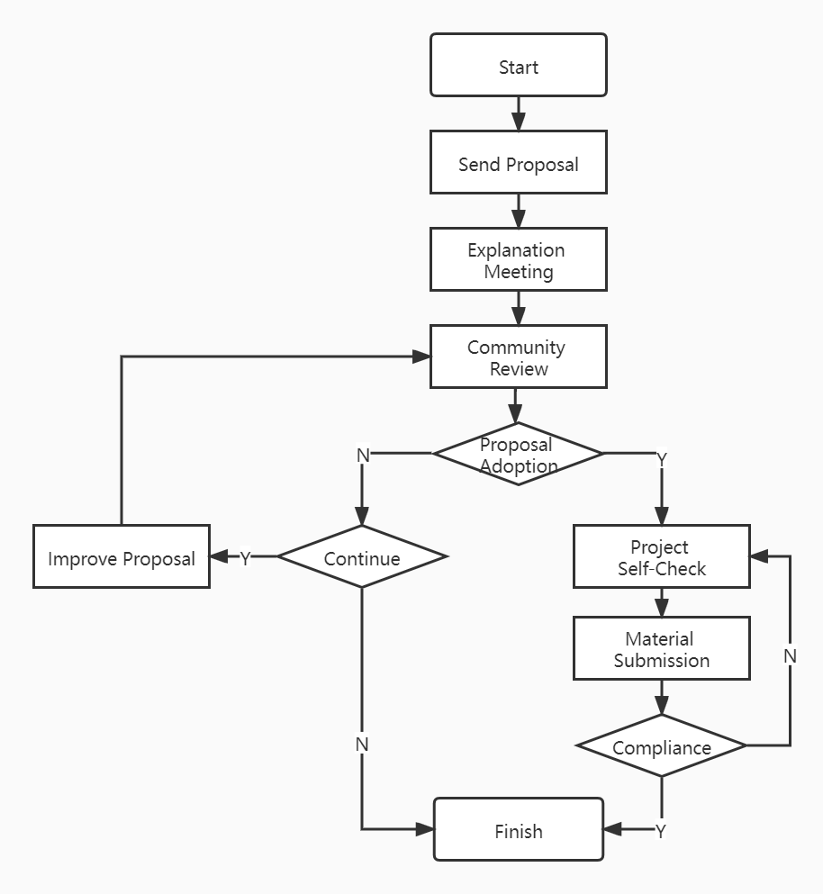

# Volcano Sub-project Governance

As the scope of Volcano is growing larger, more and more contributors show great willing to create or donate a new sub-project
for Volcano. This document details the sub-project creation process and specifications.

- [Volcano Sub-project Governance](#volcano-sub-project-governance)
  - [Sub-project Creating](#sub-project-creating)
    - [Send Creating Proposal](#send-creating-proposal)
    - [Explanation Meeting](#explanation-meeting)
    - [Community Review](#community-review)
    - [Meeting Review](#meeting-review)
    - [Publicity Review](#publicity-review)
    - [Improve the Proposal](#improve-the-proposal)
    - [Project Self-Check](#project-self-check)
    - [Material Submission](#material-submission)
    - [Appendix](#appendix)
  - [Sub-project Archiving](#sub-project-archiving)
    - [Send Archiving Proposal](#send-archiving-proposal)
    - [Explanation Meeting](#explanation-meeting-1)
    - [Community Review](#community-review-1)
    - [Voting and Approval](#voting-and-approval)
    - [Execution and Closure](#execution-and-closure)
    - [Improve the Proposal](#improve-the-proposal-1)
  - [Sub-project Removing](#sub-project-removing)
    - [Send Removing Proposal](#send-removing-proposal)
    - [Explanation Meeting](#explanation-meeting-2)
    - [Community Review](#community-review-2)
    - [Voting and Approval](#voting-and-approval-1)
    - [Improve the Proposal](#improve-the-proposal-2)
    - [Execution and Closure](#execution-and-closure-1)

## Sub-project Creating

### Send Creating Proposal

The sub-project founder send a proposal to the community by means of submitting an issue. What the issue must contain are
as follows:

* **Background**
* **Project Brief Introduction**
* **Founder Introduction**
* **License**

### Explanation Meeting

The community will assign a maintainer as the Sponsor to be responsible for the event end to end after receiving the
proposal. The Sponsor will make a quick understanding of the project and then book an explanation meeting. The founder
should give a detailed description about the project.

### Community Review

The community review consists of **meeting review** and **publicity review**. Only both reviews are passed shall the proposal be
recognised as passed.

### Meeting Review

Meeting Review is the review from the participants attending the explanation meeting.

**Only all owners and maintainers have the voting rights.**
**At least 2/3 approves from the group who have voting rights and no negative votes can be thought of proposal passed.**

### Publicity Review

* Publicity Review is the review from all the community after the explanation meeting finishes.
* **Default publicity period is 2 weeks.** Anyone can ask questions about the proposal and the founder must give explanations.
* If no negative votes, the proposal will be considered as passed by default. The sponsor will announce the final result.

If there are still some critical questions or advices not be replied, the founder has the responsibility to improve the
proposal and submit again. The sponsor undertake the task to pick out which are critical questions or advices.

### Improve the Proposal

The founder should improve the content of the proposal according to the feedback from meeting review and publicity review.
Then submit the proposal again.

### Project Self-Check

As to the projects which have already source code, the founder should finish the self-check according to the checklists
in the appendixes. If there is any questions, please contact with the sponsor for help.

### Material Submission

Once finish the project self-check, the founder will submit all the materials to the community. The material list can be
found under the appendix.

### Appendix

* Self-Check List

  | ID | Item | Description | Required | Compliance Conditions | Note |
  | :----:| :----: | :----: | :----: | :----: | :----: |
  | 1 | Code of Conduct | The conduct for the source code | Y | [Contributor Covenant Code of Conduct](https://www.contributor-covenant.org/) | Submit the code scanning report |
  | 2 | License | The License the project obeys | Y | [Apache 2.0](https://github.com/volcano-sh/volcano/blob/master/LICENSE) |  |
  | 3 | Readme | Brief introduction of the project along with the source code | Y |  |  |
  | 4 | CI/CD | The CI/CD to judge the compliance for all PRs | Y | [Github Action](https://docs.github.com/en/actions) |  |
  | 5 | Security | Security policy including vulnerability discovery and disposal | Y | [Security Release Process](https://github.com/volcano-sh/volcano/blob/master/SECURITY.md) | Submit security scanning report |
  | 6 | Roadmap | Roadmap file about the important features in the feature | Y |  |  |
  | 7 | Design Documentations | Documentations about the record of feature designs | Y |  |  |

* Material List

  | ID | Item | Description | Note |
  | :----:| :----: | :----: | :----: |
  | 1 | Source Code | The complete source code of the project |  |

## Sub-project Archiving

### Send Archiving Proposal

The proposal should be submitted as a public issue or pull request by a sub-project maintainer, sponsor, or Volcano maintainer.

The proposal must include at least:

* Current project status and archive rationale
* Maintainer availability and activity evidence
* Impact analysis for users and dependent projects
* Repository archival plan (read-only mode, labels, notices, branch policy)
* Rollback or re-activation criteria (if applicable)

### Explanation Meeting

The sponsor attended the community meeting. At the community meeting, a detailed presentation was given on the project archiving process. Meeting agenda should include:

1. Archiving rationale and evidence review
2. Dependency and risk review
3. User communication and migration plan
4. Voting and result publication

### Community Review

Archiving review includes meeting review and publicity review.

- **Meeting Review**: owners and maintainers review proposal completeness and risk controls.
- **Publicity Review**: default publicity period is two weeks, and community feedback should be addressed.

### Voting and Approval

- The archiving proposal passes only when **more than two-thirds (2/3) of Volcano maintainers** approve.
- Vote result and decision record must be published in the same issue or pull request.

### Execution and Closure

After approval:

- Set repository to archived/read-only state.
- Update repository README and relevant docs with archive notice.
- Update lifecycle state to **Archived** and sync roadmap/tracking board.
- Publish final announcement with effective date and support expectations.

### Improve the Proposal

The founder should improve the content of the proposal according to the feedback from meeting review and publicity review.
Then submit the proposal again.

## Sub-project Removing

### Send Removing Proposal

The proposal should be submitted as a public issue or pull request by a sub-project maintainer, sponsor, or Volcano maintainer.

The proposal must include at least:

- Removal rationale and evidence
- User impact, dependency impact, and risk assessment
- Asset disposition plan (repositories, teams, docs, automation resources)
- Transition plan and owner for residual responsibilities

### Explanation Meeting

The sponsor attended the community meeting. At the community meeting, a detailed presentation was given on the project removing process. Meeting agenda should include:

1. Removal rationale and alternatives evaluation
2. Risk and compliance review
3. Transition and communication plan review
4. Voting and result publication

### Community Review

Removing review includes meeting review and publicity review.

- **Meeting Review**: owners and maintainers confirm governance, legal, and technical impacts are addressed.
- **Publicity Review**: default publicity period is two weeks, and unresolved blocking concerns must be closed before voting finalization.

### Voting and Approval

- The removing proposal passes only when **more than two-thirds (2/3) of Volcano maintainers** approve.
- Vote result and decision record must be published in the same issue or pull request.

### Improve the Proposal

The founder should improve the content of the proposal according to the feedback from meeting review and publicity review.
Then submit the proposal again.

### Execution and Closure

After approval:

- Complete repository and organization cleanup based on the approved transition plan.
- Publish final announcement with effective date and user guidance.
